# Psymin (Vulnyx)

La máquina Psymin es una máquina de Vulnyx de nivel easy.

## Enumeración de puertos

Comenzamos con un escaneo de Nmap. Encontramos tres puertos abiertos: **22 (SSH)**, **80 (HTTP)** y **3000**, donde parece estar disponible PsySH.

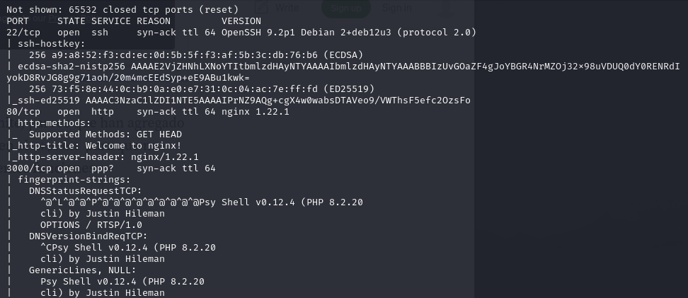

Primero revisamos la web del puerto 80, pero solo muestra la página por defecto de Nginx. Por eso continuamos con el puerto 3000.

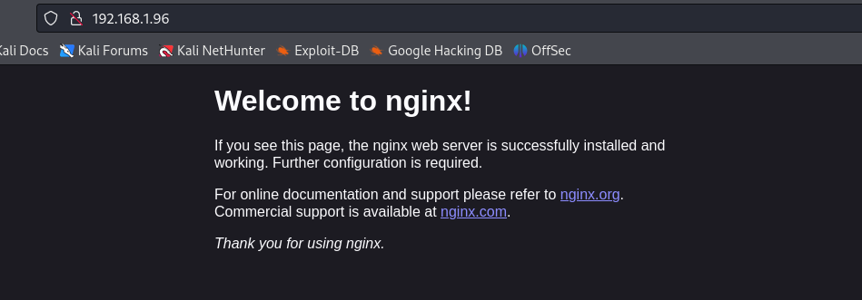

## Acceso a PsySH

La web nos muestra la página de nginx por defecto, nada interesante por aquí, probaremos de entrar al puerto 3000, por allí está corriendo el servicio PsyShell , PsySH es una consola interactiva (shell) para ejecutar código PHP sirve para escribir y ejecutar comandos PHP en tiempo real, depurar scripts, y probar fragmentos de código directamente desde la línea de comandos.

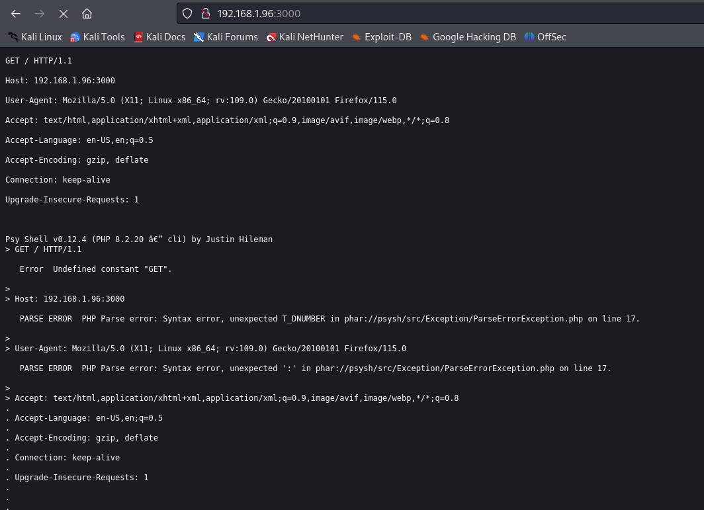

Nos conectamos al servicio vía netcat;

Encontramos una página que nos muestra comandos para Psy

[https://github.com/bobthecow/psysh/wiki/Commands](https://github.com/bobthecow/psysh/wiki/Commands)

Pero al intentar el comando pwd vemos que no nos lo permite ejecutar.

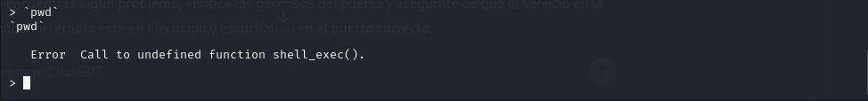

Ya que no nos permite ejecutar los comandos intentaremos leer archivos con el comando en php file_get_contents, lo probamos con el archivo /etc/passwd

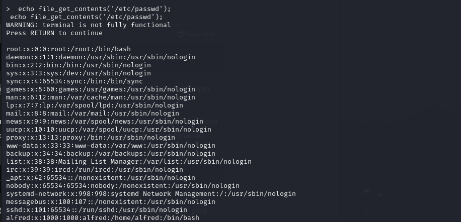

El archivo nos deja ver un potencial usuario llamado Alfred, 

## Obtención de la clave SSH

Intentamos fuerza bruta al puerto SSH, pero nos dice que no es posible el acceso con contraseña, así que probamos de leer el archivo .ssh/id_rsa para ver si nos muestra la clave.

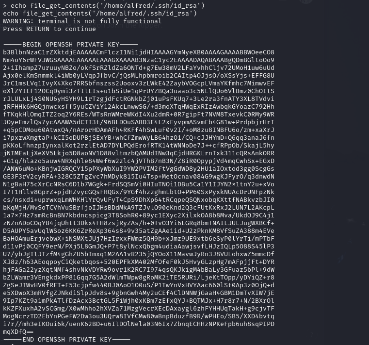

Se trata de una clave cifrada así que usaremos ssh2john para sacar el hash y poder sacar la contraseña de la clave.

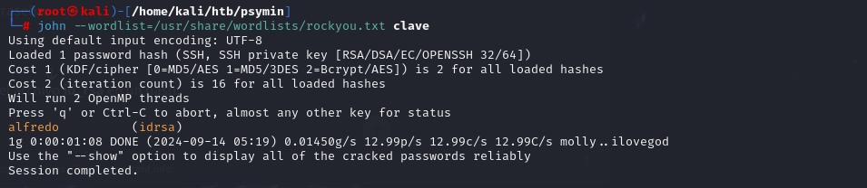

Sacamos el password de la clave, alfredo, ahora ya podemos conectarnos vía ssh.

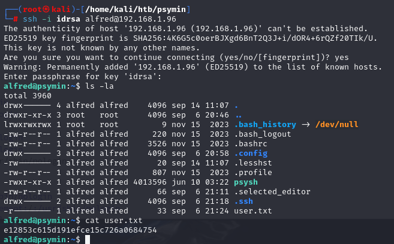

Una vez dentro encontramos la primera flag.

## Enumeración interna y acceso a Webmin

Después de varias pruebas para la escalada de privilegios nos damos cuenta que hay un servicio Webmin corriendo por el localhost en el puerto 10000.

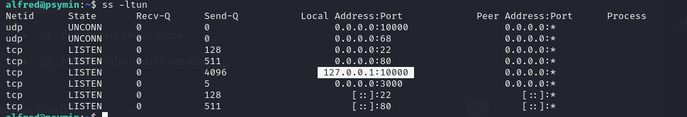

Probaremos Port Forwarding para redirigir el tráfico de ese puerto a nuestra máquina local con el comando:

`ssh -L 1000:127.0.0.1:10000 -i id_rsa alfred@192.168.1.96`

## Escalada de privilegios

Una vez redirigido ya tenemos acceso desde nuestra máquina al panel de login de webmin.

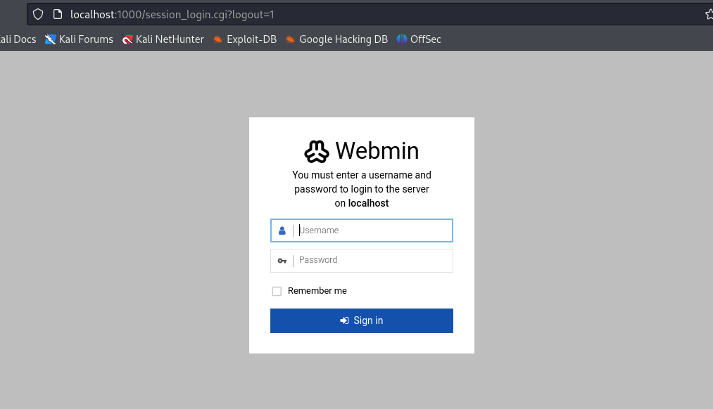

No disponemos de credenciales para acceder pero sabemos que el usuario para webmin por defecto es root, así que después de probar diferentes combinaciones clásicas, acabamos accediendo con root:root.

Una vez dentro y como ya somos root solo nos dirigimos al terminal que hay en las herramientas de webmin y ya podremos leer la flag, máquina pwneada.

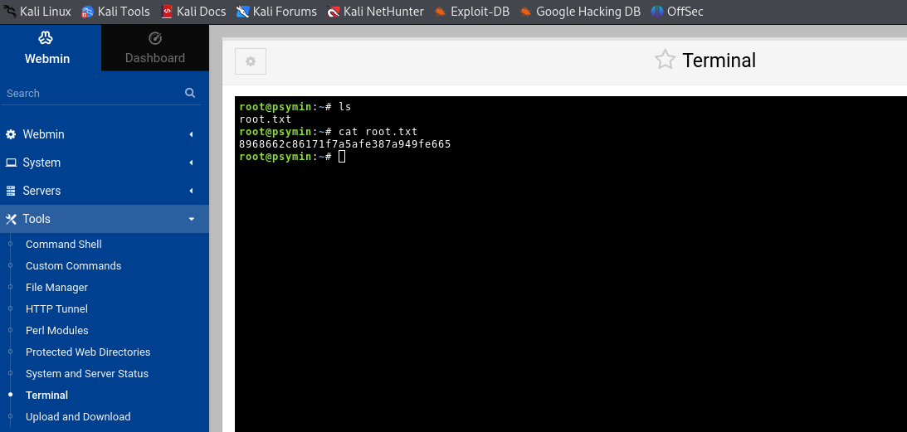
